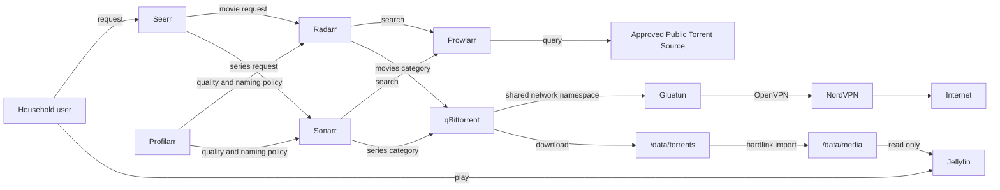
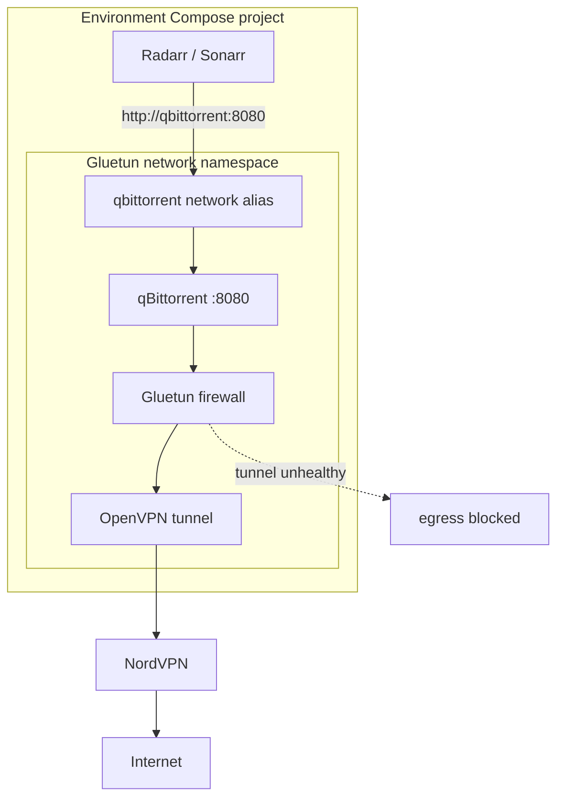
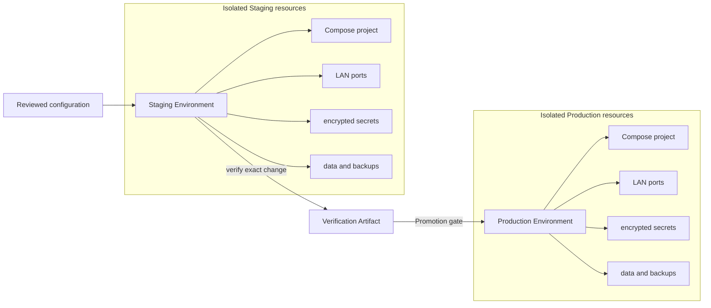
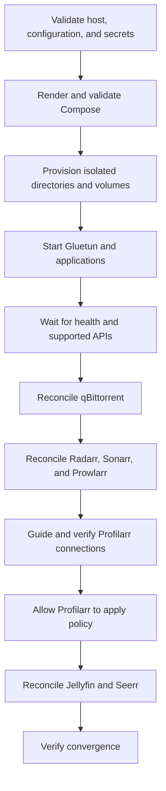

# Home Media Stack

The Home Media Stack is a reproducible, self-hosted system for requesting, acquiring, organizing, and playing movies and
episodic television. It is designed for Ubuntu and Docker Desktop with WSL 2, confines torrent traffic to NordVPN, and keeps
independent Production and Staging Environments so changes can be proven before they affect the household libraries.

> [!IMPORTANT]
> This stack is being implemented incrementally. `init`, `doctor`, the current Compose-rendering form of `plan`, and the
> VPN-confined qBittorrent startup phase of `apply` and the VPN-focused `verify --suite full` phase are available now.
> Application reconciliation, `backup`, `restore`, the remaining verification suites and artifacts, and `destroy` remain
> planned. Ubuntu is the authoritative implementation and completion platform. Docker
> Desktop WSL2 compatibility is verified independently and does not block Ubuntu work. Sections below label planned behavior explicitly.
> The authoritative target design is in the
> [implementation plan](../../docs/plans/media-stack.md) and
> [CLI contract](../../docs/plans/media-stack-cli.md).

## What the stack provides

- Jellyfin playback for the Movie Library and Series Library.
- Seerr requests with Jellyfin household authentication and approval by default.
- Radarr and Sonarr library management.
- Prowlarr discovery through an explicit approved list of Public Torrent Sources.
- qBittorrent acquisition through a fail-closed Gluetun and NordVPN boundary.
- Profilarr-managed, pinned TRaSH-derived quality and naming policy.
- One shared `/data` filesystem seam so completed downloads can be imported as hardlinks instead of copied.
- A Go CLI for initialization, preflight checks, reconciliation, verification, backups, restoration, and safe Promotion.
- Completely isolated Production and Staging Environments.

Every web interface is intended for the trusted LAN and requires authentication. Nothing is intentionally exposed to the
public internet.

## Quick start

### 1. Prepare a supported host

Use either:

- Ubuntu 22.04, 24.04, or 26.04 with Docker Engine and the Docker Compose plugin; or
- Windows with Docker Desktop using its WSL 2 backend, running all repository commands from an integrated Ubuntu WSL
  distribution.

On Ubuntu, install the base tools and `age` first:

```bash
sudo apt update
sudo apt install ca-certificates curl git age
```

Install Docker Engine from the [official Ubuntu apt-repository instructions](https://docs.docker.com/engine/install/ubuntu/).
The package step must include all of the components used by this stack:

```bash
sudo apt install docker-ce docker-ce-cli containerd.io docker-buildx-plugin docker-compose-plugin
docker version
docker compose version
```

For Windows, install [Docker Desktop with its WSL 2 backend](https://docs.docker.com/desktop/features/wsl/), enable
**Settings > Resources > WSL Integration** for the Ubuntu distribution, and install `git`, `curl`, and `age` inside that
distribution with the Ubuntu command above. Do not install a second Docker Engine inside the integrated distribution.

Install SOPS inside Ubuntu or the integrated WSL distribution. This amd64 example pins the version documented here; use the
matching `linux.arm64` release asset on arm64:

```bash
curl -LO https://github.com/getsops/sops/releases/download/v3.13.2/sops-v3.13.2.linux.amd64
curl -LO https://github.com/getsops/sops/releases/download/v3.13.2/sops-v3.13.2.checksums.txt
sha256sum --ignore-missing -c sops-v3.13.2.checksums.txt
sudo install -m 0755 sops-v3.13.2.linux.amd64 /usr/local/bin/sops
rm sops-v3.13.2.linux.amd64 sops-v3.13.2.checksums.txt
sops --version
age --version
```

Generate an age identity once and keep the identity file outside Git. Give the resulting `age1...` recipient to `init`:

```bash
mkdir -p ~/.config/sops/age
age-keygen -o ~/.config/sops/age/keys.txt
age-keygen -y ~/.config/sops/age/keys.txt
```

You also need:

- a native Linux or WSL filesystem for active downloads and libraries;
- a separate backup location for later backup tickets;
- `/dev/net/tun` and permission for Docker to grant Gluetun `NET_ADMIN`; and
- NordVPN OpenVPN **service credentials** from the Nord Account manual-setup area. These are not the Nord account email and
  password, and the stack does not need a Nord access token.

### 2. Configure and initialize Staging first

Edit `stacks/media/media-stack.yaml` before the first run. At minimum, choose absolute, non-overlapping `dataRoot` values, Compose
`projectName` values, secret-file paths, and non-conflicting LAN ports for Production and Staging. Set `runtimeUID` and
`runtimeGID` to the numeric identity that should own new data directories; for the current operator, obtain them with:

```bash
id -u
id -g
```

From the repository root, initialize Staging:

```bash
./setup.sh --environment staging
```

`setup.sh` downloads the pinned `media-stack` Linux binary for amd64 or arm64, verifies its SHA-256 checksum, caches it, and
runs `media-stack init`. `init` currently prompts for the runtime UID/GID, timezone, NordVPN country, optional P2P category,
OpenVPN UDP or TCP, Gluetun catalogue interval, age recipient, and NordVPN service credentials. Non-interactive automation can
supply the same answers explicitly:

```bash
media-stack init \
  --environment staging \
  --non-interactive \
  --answers staging-answers.yaml
```

Initialization writes the reviewable Declared Configuration and `secrets/staging.sops.yaml`; it never starts containers. It
also creates only the selected Staging Environment layout:

```text
<dataRoot>/
├── torrents/
│   ├── movies/
│   └── series/
└── media/
    ├── movies/
    └── series/
```

Every directory created by `init` uses mode `0750` and the declared runtime UID/GID. Assigning an identity other than the
operator may therefore require pre-provisioned permissions or a privileged invocation. Existing directories and their
contents are left untouched: `init` does not recursively `chown` or `chmod` data. Re-running restores missing derived
directories while preserving complete configuration and encrypted secrets.

### 3. Check prerequisites and render the selected topology

These commands are available now:

```bash
media-stack doctor --environment staging
media-stack doctor --environment staging --output json
media-stack plan --environment staging > staging-compose.yaml
docker compose -f staging-compose.yaml config --quiet
```

`doctor` checks the supported Linux/WSL platform, Docker Engine, Compose, SOPS, age, decryption of the selected Environment
secret, `/dev/net/tun`, `NET_ADMIN`, and whether the pinned Gluetun catalogue accepts the declared NordVPN filters. It also
runs disposable probes from the pinned qBittorrent, Radarr, and Sonarr images as the declared runtime UID/GID, using their
actual `/data/torrents` or `/data` bind-mount shapes. Those probes verify write permission, same-device layout, hardlink
creation and inode identity, atomic rename, filesystem events, and cleanup. Human output explains each result; JSON provides
stable diagnostic records and remedies for automation. It does not start the stack.

The current `plan` implementation validates Declared Configuration and pinned images, then writes the selected Environment
Compose model to standard output. It is useful for reviewing project scoping, ports, runtime identity, mounts, secrets,
restart policy, and bounded logging. It does not yet observe applications, create a saved Plan Artifact, or mutate the host.
Shell redirection is used above because `--out` is not implemented yet.

### 4. Start VPN-confined qBittorrent

After `doctor` passes, start Staging qBittorrent behind Gluetun:

```bash
media-stack apply --environment staging
```

The currently available `apply` phase decrypts only the selected Environment's NordVPN OpenVPN service username and
password. It atomically materializes them as `0600` files beneath the operator's `0700`
`$XDG_RUNTIME_DIR/media-stack/<projectName>/` directory, streams the value-free Compose model to Docker, starts
Gluetun, and waits up to two minutes for its built-in health check. Only after Gluetun is healthy does `apply` start
qBittorrent, which shares Gluetun's network namespace. A transient unhealthy state is polled so Gluetun can try
another catalogue endpoint; a persistent failure exits `1`. The runtime files remain while the service is running so Docker
can remount them after a container restart. Rerunning `apply` safely replaces the files and converges the same Gluetun and qBittorrent services.
Gluetun alone
publishes the selected Environment's qBittorrent Web UI port, and its firewall admits only the narrow input port `8080`
needed for that UI. Its `qbittorrent` application-network alias preserves the internal
`http://qbittorrent:8080` endpoint without granting qBittorrent an independent route. Later tickets extend `apply` to the
other services and application reconciliation.

### 5. Verify Staging VPN behavior

```bash
media-stack verify --environment staging --suite full
media-stack verify --environment staging --suite full --output json
```

The available full-suite phase verifies the Gluetun TUN device and health, resolves an external-IP service from
qBittorrent's shared namespace, and requires that tunneled address to differ from the host address. It then stops Gluetun,
requires a fresh qBittorrent-namespace request to fail, restarts Gluetun, waits up to two minutes for health, recreates
qBittorrent in Gluetun's current network namespace, and proves tunneled egress returns. Cleanup always attempts recovery after an interruption. Run it only in the
Staging Environment because it deliberately interrupts acquisition. Exit `1` means verification failed; JSON output
includes stable `VERIFY_*` diagnostics and remedies.

The smoke, Promotion, and Restore Drill suites and content-addressed Verification Artifacts remain planned.

### 6. Create Production and promote the proven change (planned)

Initialize Production separately, then use the Staging evidence when planning the Production change:

```bash
media-stack init --environment production
media-stack doctor --environment production
media-stack plan \
  --environment production \
  --verified-by staging-verification.json \
  --out production-plan.json
media-stack apply --plan production-plan.json
```

Production is never the default. A changed configuration, image digest, CLI contract, expired verification, or missing current
backup when one is required invalidates Promotion evidence.

## Target system design (planned)

### Request-to-playback flow



Seerr turns approved household requests into Radarr or Sonarr searches. Prowlarr supplies releases from explicitly approved
sources. Radarr and Sonarr submit categorized downloads to qBittorrent and hardlink completed files into the appropriate
library. Jellyfin scans the library through a read-only mount and serves it to household users.

### VPN confinement and internal addressing

qBittorrent has no network attachment of its own. It uses `network_mode: service:gluetun`, so the two containers share a
network namespace and Gluetun's firewall is qBittorrent's only egress path.



Gluetun, not qBittorrent, publishes the qBittorrent Web UI port. Gluetun also carries the `qbittorrent` alias on the
application network, preserving the stable internal address `http://qbittorrent:8080` for Radarr and Sonarr without giving
qBittorrent another route. The deployed design prohibits host networking, privileged mode, `FIREWALL=off`, and broad LAN
firewall exceptions as kill-switch workarounds.

`media-stack verify --environment staging --suite full [--config path] [--output human|json]` compares the public IP
seen from qBittorrent's shared namespace with a host-side observation, interrupts the tunnel, proves a fresh egress attempt
fails instead of using the host route, then restores Gluetun and verifies tunneled egress returns. It rejects Production
because this phase is disruptive.

### Storage and hardlinks

Each environment owns one data root with a stable in-container `/data` mapping:

```text
<data-root>/
├── torrents/
│   ├── movies/
│   └── series/
└── media/
    ├── movies/
    └── series/
```

| Service | Container mount | Access and purpose |
| --- | --- | --- |
| qBittorrent | `/data/torrents` | Writes categorized downloads |
| Radarr | `/data` | Hardlinks movies from torrents into the Movie Library |
| Sonarr | `/data` | Hardlinks episodes from torrents into the Series Library |
| Jellyfin | `/data/media` | Read-only library access |

Because all paths are below one filesystem seam, Radarr and Sonarr can create hardlinks. A torrent may continue seeding while
the library entry exists under its organized name without consuming space for a second copy. When qBittorrent later removes
its torrent data, the library hardlink remains.

`doctor` checks this behavior from disposable containers running as the declared application UID/GID. It verifies writable
paths, same-device layout, hardlink creation and inode equality, atomic rename, filesystem events, permissions, and cleanup.
Native Windows/NTFS data paths are experimental and remain unavailable unless every container-observable probe passes.

### Production and Staging isolation



The environments have distinct project names, ports, networks, volumes, secrets, API keys, data roots, backup namespaces,
and full service sets. Staging can perform real acquisition and recovery exercises without sharing state, scheduled jobs, or
integrations with Production.

Compose project scoping supplies resource names; fixed `container_name` values and shared global networks are deliberately
forbidden. Promotion means applying the exact configuration and image-version change already verified in Staging—not simply
rerunning similar commands in Production.

## Services

| Service | Responsibility | Default example ports¹ |
| --- | --- | ---: |
| Gluetun | NordVPN tunnel, firewall, and qBittorrent network namespace | — |
| qBittorrent | Categorized movie and series acquisition | 8080 / 18080 |
| Prowlarr | Approved Public Torrent Sources and Arr application links | 9696 / 19696 |
| Radarr | Movie Library management | 7878 / 17878 |
| Sonarr | Series Library management | 8989 / 18989 |
| Profilarr | Pinned TRaSH-derived quality, naming, and media policy | 6868 / 16868 |
| Jellyfin | Household media playback | 8096 / 18096 |
| Seerr | Household requests and approvals | 5055 / 15055 |

¹ Production / Staging examples from the proposed configuration. All bind-address/port tuples are configurable and must be
unique across environments.

The first milestone intentionally excludes Bazarr, Usenet, FlareSolverr, Recyclarr, a public reverse proxy, SSO, and a full
metrics/logging stack. Every long-running service uses `restart: unless-stopped` and bounded `json-file` logs by default.

## Configuration model

The stack separates intent, versions, and secrets because they change at different rates and need different handling:

```text
stacks/media/
├── media-stack.yaml              # reviewed operator intent for both environments
├── versions.yaml                 # pinned image digests and policy revision
├── secrets/
│   ├── production.sops.yaml      # SOPS-encrypted Production secrets
│   └── staging.sops.yaml         # SOPS-encrypted Staging secrets
├── fixtures/                     # explicit legal verification fixtures
└── README.md
```

The current `media-stack.yaml` schema contains only the fields below. Unknown fields are rejected, which prevents misspellings
from silently becoming ineffective configuration.

| YAML field | Current consumer | Exact effect |
| --- | --- | --- |
| `apiVersion` | all commands | Must be `homelab.media-stack/v1alpha1`. |
| `kind` | all commands | Must be `MediaStack`. |
| `spec.defaults.timezone` | `init`, `plan` | Validated as an IANA timezone; rendered as `TZ` for every service. |
| `spec.defaults.runtimeUID` / `runtimeGID` | `init`, `plan` | Own newly created data directories; render as `PUID`/`PGID` for LinuxServer-style services and Compose `user` for Jellyfin and Seerr. |
| `spec.defaults.lanBindAddress` | `plan` | Host address used for every published web port. `0.0.0.0` listens on all host interfaces. |
| `spec.environments.<name>.projectName` | `plan`, `apply` | Compose project name; scopes networks, runtime secret paths, and config volumes independently for Production and Staging. |
| `spec.environments.<name>.dataRoot` | `init`, `plan` | Absolute host root provisioned by `init`; mounted as the selected Environment `/data` seam. The other Environment root is never rendered. |
| `spec.environments.<name>.secretsFile` | `init`, `doctor`, `apply` | Environment-specific SOPS document written by `init`; `doctor` proves it can be decrypted, and `apply` materializes only its two OpenVPN values as owner-only runtime Compose secret files. `plan` never decrypts it. |
| `spec.environments.<name>.ports.qbittorrent` | `plan` | Host port published on Gluetun for the qBittorrent Web UI target `8080`; qBittorrent has no direct published port. |
| `spec.environments.<name>.ports.prowlarr` | `plan` | Host port for Prowlarr target `9696`. |
| `spec.environments.<name>.ports.sonarr` | `plan` | Host port for Sonarr target `8989`. |
| `spec.environments.<name>.ports.radarr` | `plan` | Host port for Radarr target `7878`. |
| `spec.environments.<name>.ports.profilarr` | `plan` | Host port for Profilarr target `6868`. |
| `spec.environments.<name>.ports.jellyfin` | `plan` | Host port for Jellyfin target `8096`. |
| `spec.environments.<name>.ports.seerr` | `plan` | Host port for Seerr target `5055`. |
| `spec.acquisition.vpn.provider` / `protocol` | `init`, `doctor`, `plan`, `apply` | Currently fixed to `nordvpn` and `openvpn`; rendered as Gluetun's explicit `VPN_SERVICE_PROVIDER` and `VPN_TYPE`. The CLI never requests a Nord access token or calls a Nord API. |
| `spec.acquisition.vpn.openvpnProtocol` | `init`, `doctor`, `plan`, `apply` | `udp` by default or explicit `tcp`; validated against the pinned catalogue and rendered as `OPENVPN_PROTOCOL`. |
| `spec.acquisition.vpn.server.countries` | `init`, `doctor`, `plan`, `apply` | Non-empty semantic country selection rendered as `SERVER_COUNTRIES`; an empty selection is rejected before Docker starts. |
| `spec.acquisition.vpn.server.categories` | `init`, `doctor`, `plan`, `apply` | Optional `P2P` category rendered as `SERVER_CATEGORIES`. |
| `spec.acquisition.vpn.catalogueUpdateInterval` | `init`, `plan`, `apply` | Must parse as at least `360h`; rendered as `UPDATER_PERIOD`, with `/gluetun` backed by the Environment's persistent named volume. |

Container paths, network names, config-volume names, application URLs, qBittorrent categories, restart policy, and logging
limits are derived rather than exposed as arbitrary YAML. This preserves the shared `/data` and environment-isolation
invariants.

`versions.yaml` pins every container image by digest and pins the Profilarr PCD policy input. A version-only change is still a
reviewable, verifiable change and invalidates evidence created for older digests.

### Configuration ownership

| Owner | Declared responsibility |
| --- | --- |
| Docker Compose | Images, containers, networks, ports, health checks, mounts, volumes, lifecycle, and logging |
| `media-stack` CLI | Root folders, qBittorrent settings/categories, download clients, indexers, application links, and general settings |
| Profilarr | Sonarr/Radarr quality profiles, custom formats, quality definitions, naming, upgrades, and media-management policy |
| Human through guided setup | Credentials, initial accounts, and the first Profilarr connections |

Keeping one writer per configuration domain prevents reconciliation loops. In particular, Recyclarr is excluded because it
would compete with Profilarr for the same Sonarr and Radarr policy.

### Reconciliation (planned)

The target workflow keeps Declared Configuration in the repository and observed state in the applications. The completed `plan` will compare the two and report
ordered `create`, `update`, `restart`, `guide`, `verify`, `unknown`, and eligible `delete` actions. `apply` creates missing
resources and repairs drift through supported interfaces. A successful repeated apply converges to an empty plan.

Unknown resources are reported and retained by default. Pruning is opt-in and limited to CLI-owned configuration; it requires
a current backup, unchanged preview, explicit flag, and confirmation. It never prunes media, torrent payloads,
Profilarr-owned policy, secrets, or backups.

## Secrets

Secrets are committed only as SOPS-encrypted values using age recipients. Age private identities remain outside Git. The CLI
decrypts narrowly at runtime and uses Compose secret files where the target image supports them; plaintext values must not
appear in arguments, rendered Compose, plans, reports, logs, diagnostics, or backup manifests.

`apply` writes only `openvpn_user` and `openvpn_password` beneath
`$XDG_RUNTIME_DIR/media-stack/<projectName>/` (or a per-user directory under the system temporary directory when
`XDG_RUNTIME_DIR` is unavailable). The directory is mode `0700`; both files are mode `0600`; only Gluetun receives their
Compose mounts. They are intentionally not stored in the repository or embedded in Compose environment variables. They
remain present for container restart support and are atomically replaced on the next `apply`; ending the user's runtime
session removes the standard runtime directory.

The initial VPN path uses NordVPN OpenVPN manual-setup service username/password with UDP by default and TCP as an explicit
fallback. Gluetun selects endpoints from semantic country and optional category filters, persists its server catalogue, and
may refresh it no more often than the configured minimum interval. The CLI does not request a Nord access token, call a Nord
API, or pin a single server hostname. WireGuard/NordLynx remains deferred until supported private-key acquisition is proven.

Generated application API keys stay in environment-specific mutable application state and are covered by backups unless a
documented supported interface allows stable creation and storage.

## Applying configuration

The available phase validates and renders the selected Environment, materializes Gluetun's runtime secrets, starts Gluetun,
waits boundedly for health, and then starts qBittorrent in Gluetun's network namespace. The remaining target order
below is planned.

The complete apply order will be:



If the operation is interrupted, the CLI reports completed, failed, and pending actions. It does not claim rollback where an
application cannot provide it; a later run observes current state and safely resumes toward the declaration.

## Verification suites

| Suite | Intended evidence |
| --- | --- |
| `smoke` | Rendered schema, isolation, health, API readiness, LAN reachability, and service-name resolution |
| `full` | Smoke plus storage semantics, convergence, backup sampling, VPN identity, fail-closed behavior, and recovery |
| `promotion` | Full plus legal discovery, acquisition, hardlink import, and playback |
| `restore-drill` | Recovered state, isolation, rotated credentials, disabled acquisition, and gated integrations |

Disruptive checks are confined to disposable resources or Staging and restore any perturbed state. Production permits only
non-disruptive smoke observations. The detailed testing strategy is being resolved in the
[testing Wayfinder map](https://github.com/adkulas/homelab/issues/37).

## Backups, restore, and Restore Drills

```bash
media-stack backup --environment production --protect --label before-upgrade
media-stack restore --environment production --backup <backup-id>
media-stack restore \
  --environment staging \
  --backup <production-backup-id> \
  --as-restore-drill \
  --credentials stacks/media/secrets/staging-drill.sops.yaml
media-stack verify --environment staging --suite restore-drill
```

A backup quiesces services when required, archives every mutable service configuration volume, calculates checksums, and
writes a versioned manifest last. Media and incomplete downloads are deliberately excluded: repository configuration and
application-state backups reconstruct the stack, while media protection is a separate storage policy.

The initial retention policy keeps 7 daily, 4 weekly, and 6 monthly archives. Protected and Promotion-referenced backups are
never expired by retention. Production and Staging backups use separate namespaces; the backup root should preferably live
on another disk or NAS.

Ordinary restore only accepts a backup from the same environment. A Restore Drill is the one Production-to-Staging
exception: it preserves Staging identity, rotates external credentials, starts with acquisition disabled, and gates
integrations until confirmed. Production Profilarr state embeds Production-specific connections, so the initial design keeps
Staging's Profilarr state and records Production Profilarr as an explicit drill exclusion.

## Command reference

| Command | Availability | What it does and why to use it |
| --- | --- | --- |
| `media-stack init --environment production|staging [--config path]` | Available | Interactively completes runtime/VPN choices, encrypts that Environment credentials, and provisions its isolated data layout. Use it once per Environment and rerun it to restore missing directories without replacing complete choices. |
| `media-stack init --environment ... --non-interactive --answers path` | Available | Performs the same initialization from a strict answer document. Use it for repeatable automation; missing or unknown answers fail. |
| `media-stack doctor --environment production|staging [--config path] [--output human|json]` | Available | Runs host, tooling, secret, TUN, Gluetun-filter, and container-visible storage preflights through the declared runtime identity. Use it before attempting startup; exit `1` means at least one diagnostic failed. |
| `media-stack plan --environment production|staging [--config path]` | Available, render-only | Writes rendered Compose YAML to stdout without mutation. Use it to inspect the selected Environment topology or pipe it to `docker compose config`. Application observation and saved Plan Artifacts are not implemented yet. |
| `media-stack apply --environment production|staging [--config path]` | Available, VPN-confined qBittorrent phase | Decrypts the selected Environment's OpenVPN service credentials into owner-only runtime Compose secret files, starts Gluetun, waits up to 120 seconds for health, then starts qBittorrent in the shared namespace. Use it after `doctor`; repeated runs converge both services. Remaining application startup and reconciliation are planned. |
| `media-stack backup` | Planned | Will create verified, checksummed application-state archives. It is not accepted by the current binary. |
| `media-stack restore` | Planned | Will preview and safely restore compatible Environment state. It is not accepted by the current binary. |
| `media-stack verify --environment staging --suite full [--config path] [--output human|json]` | Available, VPN verification phase | Proves TUN availability, healthy tunneled qBittorrent egress distinct from host egress, fail-closed behavior during a controlled Gluetun stop, and recovery. Use it after `apply` in Staging; it is deliberately rejected for Production. Smoke, Promotion, Restore Drill, and Verification Artifact behavior remain planned. |
| `media-stack destroy` | Planned | Will remove only selected-Environment runtime resources behind explicit safety guards. It is not accepted by the current binary. |

Every currently available command requires an explicit `production` or `staging`; Production is never inferred. A relative
`--config` path is resolved from the working directory, while omitting it selects `stacks/media/media-stack.yaml` from the
repository root.

The current VPN-confined qBittorrent apply phase shares the renderer with `plan`; later mutation phases will add saved
Plan Artifacts, Environment locking, confirmation, and volatile safety rechecks. Planned `destroy` will never purge media, torrent payloads,
backups, secrets, or Declared Configuration.

## Operating principles

- Start in Staging and Promote exact verified changes.
- Treat `up -d` as container startup, not proof that the system works.
- Use application APIs and CLI evidence instead of relying on remembered UI state.
- Pin images and policy inputs; never deploy mutable `latest` tags.
- Keep active downloads and libraries on the same capable filesystem.
- Let Sonarr and Radarr own deliberate library removal; Jellyfin and Seerr do not delete media.
- Back up before pruning, replacing mutable state, changing images, restoring, or removing volumes.
- Never weaken Gluetun's firewall to make acquisition work.

## Design references

- [Media Stack implementation plan](../../docs/plans/media-stack.md)
- [Media Stack CLI and Declared Configuration design](../../docs/plans/media-stack-cli.md)
- [ADR: cross-platform Compose Media Stack](../../docs/adr/0001-cross-platform-compose-media-stack.md)
- [ADR: Profilarr owns TRaSH-derived policy](../../docs/adr/0002-profilarr-owns-trash-derived-policy.md)
- [ADR: isolate Production and Staging](../../docs/adr/0003-isolate-production-and-staging.md)
- [Gluetun and NordVPN research](../../docs/research/gluetun-nordvpn.md)
- [arr-new teaching-reference analysis](../../docs/research/arr-new-compose.md)
- [Home Media Stack implementation map](https://github.com/adkulas/homelab/issues/36)
- [Media Stack testing-strategy map](https://github.com/adkulas/homelab/issues/37)
