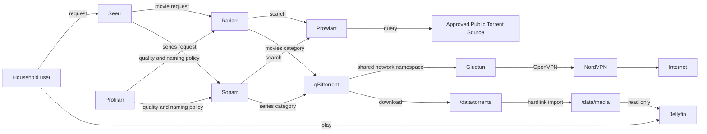
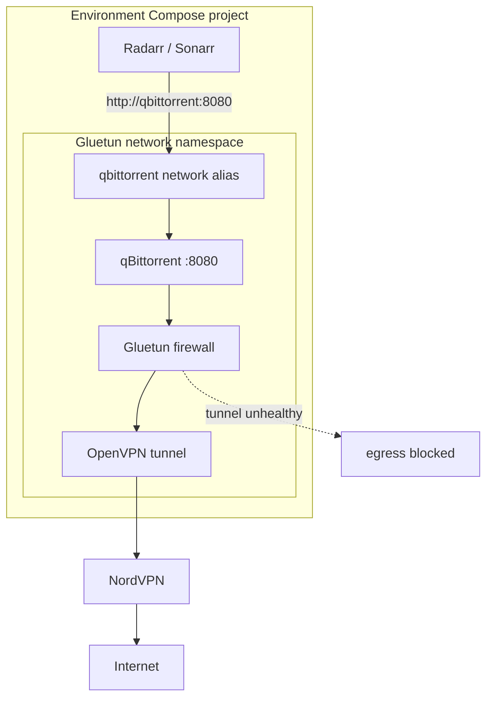
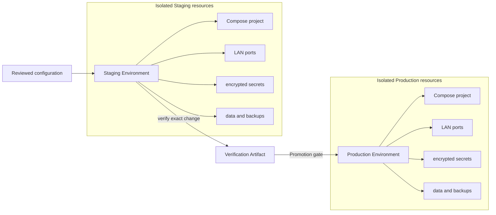
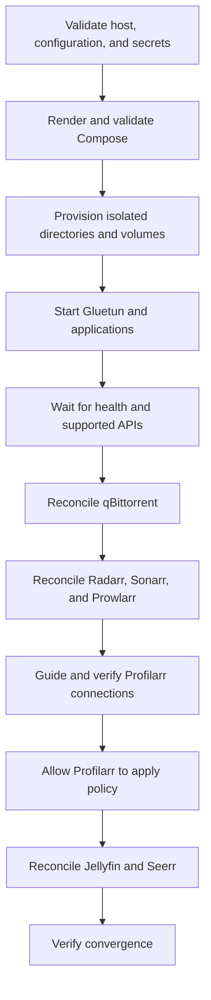

# Home Media Stack

The Home Media Stack is a reproducible, self-hosted system for requesting, acquiring, organizing, and playing movies and
episodic television. It is designed for Ubuntu and Docker Desktop with WSL 2, confines torrent traffic to NordVPN, and keeps
independent Production and Staging Environments so changes can be proven before they affect the household libraries.

> [!IMPORTANT]
> This stack is currently **planned, not implemented**. The commands and file paths below describe the target operator
> experience tracked by the [implementation map](https://github.com/adkulas/homelab/issues/36). They will become executable
> as its child tickets land. The authoritative design is in the
> [implementation plan](../../docs/plans/media-stack.md) and
> [CLI contract](../../docs/plans/media-stack-cli.md).

## What the stack provides

- Jellyfin playback for the Movie Library and Series Library.
- Seerr requests with Jellyfin household authentication and approval by default.
- Radarr and Sonarr library management.
- Prowlarr discovery through an explicit approved list of Public Torrent Sources.
- qBittorrent acquisition through a fail-closed Gluetun and NordVPN boundary.
- Profilarr-managed, pinned TRaSH-derived quality and naming policy.
- One shared `/data` filesystem seam so completed downloads can be imported as hardlinks instead of copied.
- A Go CLI for initialization, preflight checks, reconciliation, verification, backups, restoration, and safe Promotion.
- Completely isolated Production and Staging Environments.

Every web interface is intended for the trusted LAN and requires authentication. Nothing is intentionally exposed to the
public internet.

## Quick start

### 1. Prepare a supported host

Use either:

- Ubuntu with Docker Engine and the Docker Compose plugin; or
- Windows with Docker Desktop's WSL 2 backend, running these commands from an integrated WSL distribution.

You will also need `age` and SOPS, a native Linux or WSL filesystem for active media and downloads, a separate backup
location, and NordVPN OpenVPN **service credentials** from the Nord Account manual-setup area. These are not your Nord
account email and password, and no Nord access token is required.

The host must expose `/dev/net/tun` and permit the `NET_ADMIN` capability used by Gluetun. The planned `doctor` command checks
all of these prerequisites before anything starts.

### 2. Initialize Staging first

From the repository root, the planned bootstrap entry point is:

```bash
./setup.sh
```

It downloads or locates a pinned, checksum-verified `media-stack` CLI and starts the interactive initializer. Select the
Staging Environment first. The initializer collects:

- Staging data and backup roots;
- unique LAN ports and Compose project identity;
- timezone and the numeric UID/GID used by storage-owning containers;
- an age recipient and environment-specific secret values;
- NordVPN country/category intent and OpenVPN UDP or TCP; and
- optional hardware-transcoding preference.

Initialization writes Declared Configuration and SOPS-encrypted secrets, but does not start containers. It is safe to rerun:
existing choices are preserved and only missing answers are requested.

### 3. Check, preview, and apply

```bash
media-stack doctor --environment staging
media-stack plan --environment staging --out staging-plan.json
media-stack apply --plan staging-plan.json
```

`doctor` validates the host, storage, secrets, ports, VPN prerequisites, and container-visible hardlink behavior. `plan` makes
the intended changes reviewable without starting the stack. `apply` rejects an expired or stale saved plan rather than
silently executing different actions.

During the first apply, the CLI starts and reconciles the services in dependency order. Profilarr currently requires one
guided UI step to connect it to Radarr and Sonarr in each environment; the CLI pauses, explains the action, and verifies its
completion before continuing.

### 4. Verify Staging

```bash
media-stack verify --environment staging --suite smoke
media-stack verify --environment staging --suite full
```

The smoke suite checks rendered topology, isolation, health, APIs, LAN reachability, and internal service discovery. The full
suite additionally checks storage semantics, configuration convergence, backup sampling, VPN egress, fail-closed behavior,
and recovery.

A Promotion verification also exercises a repository-declared legal acquisition fixture:

```bash
media-stack verify \
  --environment staging \
  --suite promotion \
  --legal-fixture stacks/media/fixtures/legal-movie.yaml
```

Success emits a content-addressed Verification Artifact bound to the exact Declared Configuration and pinned versions.

### 5. Create Production and promote the proven change

Initialize Production separately, then use the Staging evidence when planning the Production change:

```bash
media-stack init --environment production
media-stack doctor --environment production
media-stack plan \
  --environment production \
  --verified-by staging-verification.json \
  --out production-plan.json
media-stack apply --plan production-plan.json
```

Production is never the default. A changed configuration, image digest, CLI contract, expired verification, or missing current
backup when one is required invalidates Promotion evidence.

## How the system works

### Request-to-playback flow



Seerr turns approved household requests into Radarr or Sonarr searches. Prowlarr supplies releases from explicitly approved
sources. Radarr and Sonarr submit categorized downloads to qBittorrent and hardlink completed files into the appropriate
library. Jellyfin scans the library through a read-only mount and serves it to household users.

### VPN confinement and internal addressing

qBittorrent has no network attachment of its own. It uses `network_mode: service:gluetun`, so the two containers share a
network namespace and Gluetun's firewall is qBittorrent's only egress path.



Gluetun, not qBittorrent, publishes the qBittorrent Web UI port. Gluetun also carries the `qbittorrent` alias on the
application network, preserving the stable internal address `http://qbittorrent:8080` for Radarr and Sonarr without giving
qBittorrent another route. The deployed design prohibits host networking, privileged mode, `FIREWALL=off`, and broad LAN
firewall exceptions as kill-switch workarounds.

`media-stack verify` compares the public IP seen from the shared namespace with a host-side observation, interrupts the
tunnel, proves a fresh qBittorrent egress attempt fails instead of using the host route, then restores and verifies the
tunnel.

### Storage and hardlinks

Each environment owns one data root with a stable in-container `/data` mapping:

```text
<data-root>/
├── torrents/
│   ├── movies/
│   └── series/
└── media/
    ├── movies/
    └── series/
```

| Service | Container mount | Access and purpose |
| --- | --- | --- |
| qBittorrent | `/data/torrents` | Writes categorized downloads |
| Radarr | `/data` | Hardlinks movies from torrents into the Movie Library |
| Sonarr | `/data` | Hardlinks episodes from torrents into the Series Library |
| Jellyfin | `/data/media` | Read-only library access |

Because all paths are below one filesystem seam, Radarr and Sonarr can create hardlinks. A torrent may continue seeding while
the library entry exists under its organized name without consuming space for a second copy. When qBittorrent later removes
its torrent data, the library hardlink remains.

`doctor` checks this behavior from disposable containers running as the declared application UID/GID. It verifies writable
paths, same-device layout, hardlink creation and inode equality, atomic rename, filesystem events, permissions, and cleanup.
Native Windows/NTFS data paths are experimental and remain unavailable unless every container-observable probe passes.

### Production and Staging isolation



The environments have distinct project names, ports, networks, volumes, secrets, API keys, data roots, backup namespaces,
and full service sets. Staging can perform real acquisition and recovery exercises without sharing state, scheduled jobs, or
integrations with Production.

Compose project scoping supplies resource names; fixed `container_name` values and shared global networks are deliberately
forbidden. Promotion means applying the exact configuration and image-version change already verified in Staging—not simply
rerunning similar commands in Production.

## Services

| Service | Responsibility | Default example ports¹ |
| --- | --- | ---: |
| Gluetun | NordVPN tunnel, firewall, and qBittorrent network namespace | — |
| qBittorrent | Categorized movie and series acquisition | 8080 / 18080 |
| Prowlarr | Approved Public Torrent Sources and Arr application links | 9696 / 19696 |
| Radarr | Movie Library management | 7878 / 17878 |
| Sonarr | Series Library management | 8989 / 18989 |
| Profilarr | Pinned TRaSH-derived quality, naming, and media policy | 6868 / 16868 |
| Jellyfin | Household media playback | 8096 / 18096 |
| Seerr | Household requests and approvals | 5055 / 15055 |

¹ Production / Staging examples from the proposed configuration. All bind-address/port tuples are configurable and must be
unique across environments.

The first milestone intentionally excludes Bazarr, Usenet, FlareSolverr, Recyclarr, a public reverse proxy, SSO, and a full
metrics/logging stack. Every long-running service uses `restart: unless-stopped` and bounded `json-file` logs by default.

## Configuration model

The stack separates intent, versions, and secrets because they change at different rates and need different handling:

```text
stacks/media/
├── media-stack.yaml              # reviewed operator intent for both environments
├── versions.yaml                 # pinned image digests and policy revision
├── secrets/
│   ├── production.sops.yaml      # SOPS-encrypted Production secrets
│   └── staging.sops.yaml         # SOPS-encrypted Staging secrets
├── fixtures/                     # explicit legal verification fixtures
└── README.md
```

`media-stack.yaml` declares semantic choices such as environment roots, LAN ports, runtime identity, VPN server filters,
approved source IDs, request policy, backup retention, and verification fixtures. It does not expose arbitrary Compose
topology. The CLI derives paths, networks, volume names, qBittorrent categories, application URLs, logging defaults, and the
mandatory service set so that safety properties remain enforceable.

`versions.yaml` pins every container image by digest and pins the Profilarr PCD policy input. A version-only change is still a
reviewable, verifiable change and invalidates evidence created for older digests.

### Configuration ownership

| Owner | Declared responsibility |
| --- | --- |
| Docker Compose | Images, containers, networks, ports, health checks, mounts, volumes, lifecycle, and logging |
| `media-stack` CLI | Root folders, qBittorrent settings/categories, download clients, indexers, application links, and general settings |
| Profilarr | Sonarr/Radarr quality profiles, custom formats, quality definitions, naming, upgrades, and media-management policy |
| Human through guided setup | Credentials, initial accounts, and the first Profilarr connections |

Keeping one writer per configuration domain prevents reconciliation loops. In particular, Recyclarr is excluded because it
would compete with Profilarr for the same Sonarr and Radarr policy.

### Reconciliation

The repository holds Declared Configuration; the applications hold observed state. `plan` compares the two and reports
ordered `create`, `update`, `restart`, `guide`, `verify`, `unknown`, and eligible `delete` actions. `apply` creates missing
resources and repairs drift through supported interfaces. A successful repeated apply converges to an empty plan.

Unknown resources are reported and retained by default. Pruning is opt-in and limited to CLI-owned configuration; it requires
a current backup, unchanged preview, explicit flag, and confirmation. It never prunes media, torrent payloads,
Profilarr-owned policy, secrets, or backups.

## Secrets

Secrets are committed only as SOPS-encrypted values using age recipients. Age private identities remain outside Git. The CLI
decrypts narrowly at runtime and uses Compose secret files where the target image supports them; plaintext values must not
appear in arguments, rendered Compose, plans, reports, logs, diagnostics, or backup manifests.

The initial VPN path uses NordVPN OpenVPN manual-setup service username/password with UDP by default and TCP as an explicit
fallback. Gluetun selects endpoints from semantic country and optional category filters, persists its server catalogue, and
may refresh it no more often than the configured minimum interval. The CLI does not request a Nord access token, call a Nord
API, or pin a single server hostname. WireGuard/NordLynx remains deferred until supported private-key acquisition is proven.

Generated application API keys stay in environment-specific mutable application state and are covered by backups unless a
documented supported interface allows stable creation and storage.

## Applying configuration

The planned apply order is:



If the operation is interrupted, the CLI reports completed, failed, and pending actions. It does not claim rollback where an
application cannot provide it; a later run observes current state and safely resumes toward the declaration.

## Verification suites

| Suite | Intended evidence |
| --- | --- |
| `smoke` | Rendered schema, isolation, health, API readiness, LAN reachability, and service-name resolution |
| `full` | Smoke plus storage semantics, convergence, backup sampling, VPN identity, fail-closed behavior, and recovery |
| `promotion` | Full plus legal discovery, acquisition, hardlink import, and playback |
| `restore-drill` | Recovered state, isolation, rotated credentials, disabled acquisition, and gated integrations |

Disruptive checks are confined to disposable resources or Staging and restore any perturbed state. Production permits only
non-disruptive smoke observations. The detailed testing strategy is being resolved in the
[testing Wayfinder map](https://github.com/adkulas/homelab/issues/37).

## Backups, restore, and Restore Drills

```bash
media-stack backup --environment production --protect --label before-upgrade
media-stack restore --environment production --backup <backup-id>
media-stack restore \
  --environment staging \
  --backup <production-backup-id> \
  --as-restore-drill \
  --credentials stacks/media/secrets/staging-drill.sops.yaml
media-stack verify --environment staging --suite restore-drill
```

A backup quiesces services when required, archives every mutable service configuration volume, calculates checksums, and
writes a versioned manifest last. Media and incomplete downloads are deliberately excluded: repository configuration and
application-state backups reconstruct the stack, while media protection is a separate storage policy.

The initial retention policy keeps 7 daily, 4 weekly, and 6 monthly archives. Protected and Promotion-referenced backups are
never expired by retention. Production and Staging backups use separate namespaces; the backup root should preferably live
on another disk or NAS.

Ordinary restore only accepts a backup from the same environment. A Restore Drill is the one Production-to-Staging
exception: it preserves Staging identity, rotates external credentials, starts with acquisition disabled, and gates
integrations until confirmed. Production Profilarr state embeds Production-specific connections, so the initial design keeps
Staging's Profilarr state and records Production Profilarr as an explicit drill exclusion.

## Command reference

| Command | Purpose |
| --- | --- |
| `media-stack init` | Collect and write environment-specific Declared Configuration and encrypted secrets |
| `media-stack doctor` | Diagnose host, dependency, storage, secret, network, and hardware readiness |
| `media-stack plan` | Render Compose, observe applications, and preview ordered actions without mutation |
| `media-stack apply` | Execute a reviewed plan and reconcile to convergence |
| `media-stack backup` | Create verified, checksummed application-state archives |
| `media-stack restore` | Preview and safely restore compatible environment state |
| `media-stack verify` | Run named operational suites and emit evidence |
| `media-stack destroy` | Remove selected-environment runtime resources behind explicit safety guards |

Every environment-scoped command requires exactly one of `production` or `staging`. Commands support human output and
versioned JSON where useful. Mutation commands share the planner, take an environment lock, and recheck volatile safety
conditions before execution.

`destroy` removes only selected-environment containers and networks by default. Removing mutable volumes needs a saved plan,
current backup, and second confirmation. There is deliberately no purge option for media, torrent payloads, backups, secrets,
or Declared Configuration.

## Operating principles

- Start in Staging and Promote exact verified changes.
- Treat `up -d` as container startup, not proof that the system works.
- Use application APIs and CLI evidence instead of relying on remembered UI state.
- Pin images and policy inputs; never deploy mutable `latest` tags.
- Keep active downloads and libraries on the same capable filesystem.
- Let Sonarr and Radarr own deliberate library removal; Jellyfin and Seerr do not delete media.
- Back up before pruning, replacing mutable state, changing images, restoring, or removing volumes.
- Never weaken Gluetun's firewall to make acquisition work.

## Design references

- [Media Stack implementation plan](../../docs/plans/media-stack.md)
- [Media Stack CLI and Declared Configuration design](../../docs/plans/media-stack-cli.md)
- [ADR: cross-platform Compose Media Stack](../../docs/adr/0001-cross-platform-compose-media-stack.md)
- [ADR: Profilarr owns TRaSH-derived policy](../../docs/adr/0002-profilarr-owns-trash-derived-policy.md)
- [ADR: isolate Production and Staging](../../docs/adr/0003-isolate-production-and-staging.md)
- [Gluetun and NordVPN research](../../docs/research/gluetun-nordvpn.md)
- [arr-new teaching-reference analysis](../../docs/research/arr-new-compose.md)
- [Home Media Stack implementation map](https://github.com/adkulas/homelab/issues/36)
- [Media Stack testing-strategy map](https://github.com/adkulas/homelab/issues/37)
